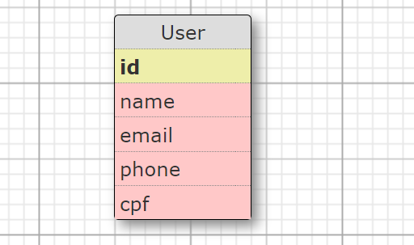
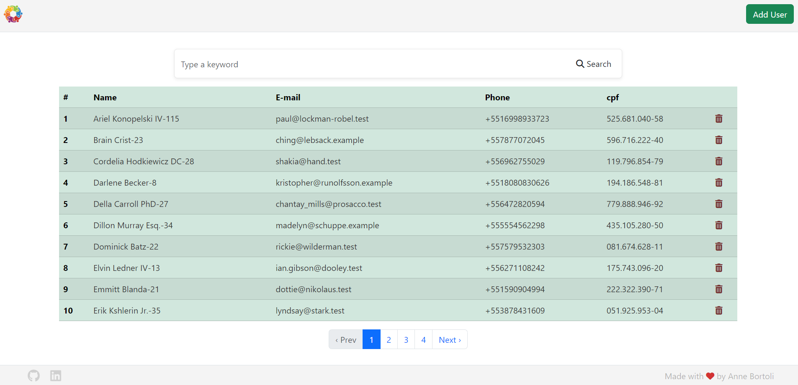
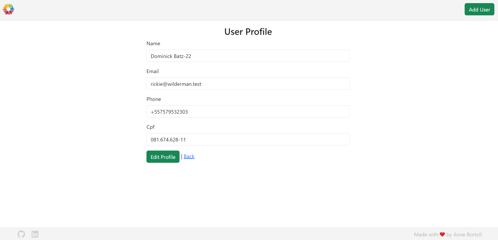
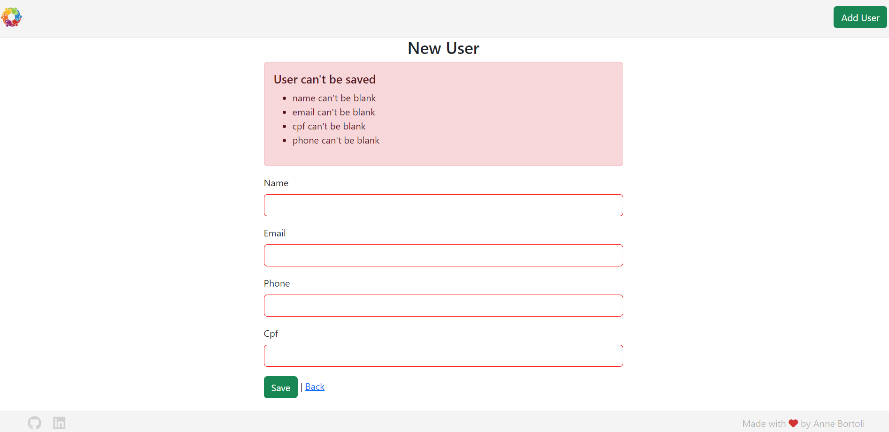

# Users validations

<!-- TABLE OF CONTENTS -->

## Table of Contents

- [:notebook_with_decorative_cover:About the project](#notebook_with_decorative_coverabout-the-project)
  - [🛠️Technologies](#🛠️technologies)
  - [📑Business rules](#�business-rules)
  - [:card_file_box:Database Schema](#card_file_boxdatabase-schema)
  - [:truck:Endpoints](#truckendpoints)
- [:book:General instructions](#bookgeneral-instructions)
  - [:electric_plug:Installation](#electric_pluginstallation)
- [:book:Usage Examples](#bookusage-examples)
- [:technologist:Developer](#developer)

<!-- ABOUT THE PROJECT -->

## :notebook_with_decorative_cover:About the project

This is an application build using Ruby on Rails, using the Bootstrap.

The main objetive of this application is to apply validations to the fields while creating and editing new users. Therefore, this application doesn't use authentication.

If you want to add sign in/login functionalites you can use a flexible authentication solution for Rails with gem Devise(https://rubygems.org/gems/devise/versions/4.2.0?locale=en).

It's possible to see a list of all Users sorted alphabetically, and search for other users by any attribute (name, email, phone number or cpf). You cant also add, edit, create and delete users.

### 🛠️Technologies

<ul>
  <li>Ruby 3.1.2</li>
  <li>Rails 7.0.8</li>
  <li>SQLite</li>
  <li>HTML5</li>
  <li>CSS3</li>
  <li>Bootstrap</li>
  <li>Regex</li>
  <li>Minitest</li>
</ul>

### 📑Business rules

- Everyone can see the users list;
- Everyone can search for users by any of the fields in the users table;
- The users should be organized alphabetically by name;
- Everyone can add a new User to the users list;
- Everyone can edit a user;
- Everyone can delete a user;

- The User's model should validate the name, email, phone, and CPF format before saving and display an error message if it's invalid;
- Pagination was added to the users list with _gem pagy_, only 10 users per page;
- To validate the CPF attribute we use the _gem 'cpf_cnpf'`_. A valid CPF includes the following formats:

  `[ 33638551687, 096.040.054-05]`

- A valid phone number format includes the following formats:
  `BR Cel phones: [(11) 12345-6789, 11 12345-6789, 11 123456789, 11123456789]`
  `BR Landline phones [(11) 1234-5678, 11 1234-5678, 11 12345678, 1112345678]`

### :card_file_box:Database Schema

<div align="center">
  
</div>

### :truck:Endpoints

- User Endpoints

| URL / ENDPOINT | VERB   | DESCRIPTION      |
| -------------- | ------ | ---------------- |
| /users         | GET    | Return all Users |
| /users/:id     | GET    | Return a User    |
| /users         | POST   | Create a User    |
| /users/:id     | PATCH  | Update a User    |
| /users/:id     | DELETE | Delete a User    |

<!-- GETTING STARTED -->

## :book:General instructions

Below are the instructions for the installation, configuration, and use of the application.

### :electric_plug:Installation

1. Clone the repo

```sh
   git clone git@github.com:ANNEBORTOLI/users-validations.git
   cd users-validations
```

2. Installing Packages(gems)

```sh
    bundle install
```

3. Create a db, run migrations and run seed

```sh
    rails db:create db:migrate db:seed
```

4. Run the Application locally

```sh
    rails s
    Visit https://localhost:3000.com
```

5. Run tests

```sh
  rails test
```

## :camera_flash:Usage Examples

- Users List
<div align="center">
  
</div>
<br>

- User Profile
<div align="center">
  
</div>
<br>

- User Validations
<div align="center">
  
</div>
<br>

## :technologist:Developer

- [Github](https://github.com/ANNEBORTOLI)
- [Linkedin](https://www.linkedin.com/in/anne-bortoli/)
